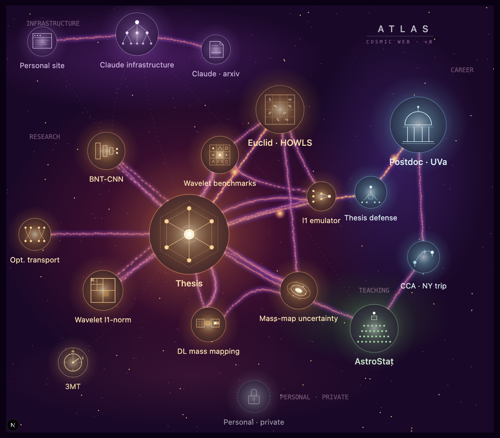

# Atlas

A personal operating system that takes the visual form of a cosmic web. Each project in Andreas Tersenov's life is a luminous halo on the web; filaments connect halos that share methodology, dependencies, or career arcs.



This repo ships **v0**: the public-facing map. No backend, no auth, no agents — just the rendered cosmic web. v1 layers on auth, integrations, and agent dispatch (see [`docs/ATLAS_HANDOFF.md`](docs/ATLAS_HANDOFF.md)).

## Tech stack

- **Framework**: Next.js 16 (App Router) + React 19 + TypeScript
- **Styling**: Tailwind v4
- **Rendering**: HTML5 Canvas, hand-rolled — no map library
  - Static layers pre-baked to an offscreen canvas; hover repaints just blit and overlay
  - Sprite-based matter clumps (one gradient sprite per intensity, scaled+rotated per clump)
  - All 18 glyphs traced vertex-by-vertex from `references/atlas_cosmic_web_v8.svg`
- **Data**: `data/halos.json` + `data/filaments.json` — single edits add halos / connections
- **Deploy**: Vercel, fully static (page is prerendered at build time, `○ (Static)`)

## Run locally

```bash
npm install
cp .env.example .env.local   # then fill in real values (see below)
npm run dev
```

Then open http://localhost:3000 (or whichever port is free).

The map fills the viewport. Hover a halo to brighten it; click a halo to log its id to the console (routing arrives in v1).

### Local dev environment

`.env.local` holds secrets and provider URLs — never commit it. Copy `.env.example` and fill in:

| Var | Where to get it |
|---|---|
| `NEXT_PUBLIC_SUPABASE_URL` | Supabase dashboard → Settings → API |
| `NEXT_PUBLIC_SUPABASE_ANON_KEY` | Same page; safe to expose |
| `SUPABASE_SERVICE_ROLE_KEY` | Same page; **server-only**, never in browser code |
| `GITHUB_PAT` | github.com/settings/tokens (classic, `repo` scope) — for Phase 4 |
| `MODAL_AGENT_URL` | Generated by `modal deploy` in Phase 5 |

For v0 (the public map at `/`), none of the above are needed — the page reads from `data/halos.json` at build time. Env vars become necessary in Phase 1 (seed script) and beyond.

### Supabase schema + seed flow

The cockpit (v1+) reads halo + filament data from Supabase. The JSON files in `data/` remain the source of truth; Supabase is a downstream mirror, re-seeded after any JSON edit.

```bash
# Once, after first clone or new Supabase project:
npx supabase login                                       # interactive (opens browser)
npx supabase link --project-ref <your-project-ref>       # links repo to Supabase project
npm run db:push                                          # applies migrations in supabase/migrations/
npm run db:types                                         # regenerates lib/database.types.ts

# Every time data/halos.json or data/filaments.json changes:
npm run db:seed                                          # upserts halos + filaments
npm run db:seed -- --prune                               # also deletes rows not in JSON
```

The seed script uses `SUPABASE_SERVICE_ROLE_KEY` to bypass RLS, validates JSON via the zod schema in `lib/halo-schema.ts`, then upserts. Idempotent — safe to re-run.

## Build + deploy

```bash
npm run build       # produces .next/ — fully static
npx vercel          # preview deploy
npx vercel --prod   # production
```

## Project layout

```
app/
  page.tsx                public map (filters halos to is_public || locked)
  layout.tsx              metadata + dark body
  globals.css
components/CosmicWebMap/
  index.tsx               client component: canvas, ResizeObserver, hit-test, hover/click
  renderer.ts             z-ordered draw layers + offscreen-cache management
  glyphs.ts               18 glyph drawing functions, parameterised by halo.r
  colors.ts               palette constants (nebulas, matter gradients, halo per-domain)
  types.ts
data/
  halos.json              19 halos (17 public + 2 private — 1 rendered as locked)
  filaments.json          career-arc, knowledge, dependency, infrastructure, faint cross-cluster
docs/
  ATLAS_HANDOFF.md        full design document — read this for context
  screenshots/v0.png
references/
  atlas_cosmic_web_v8.svg the visual reference v0 was built against
```

## Design context

The `docs/ATLAS_HANDOFF.md` file is the source of truth for what Atlas is, why each tech choice was made, the data model, the integration matrix, and the phased build plan from v0 through v3. **Read it before extending the map** — many decisions there are settled and shouldn't be relitigated.
